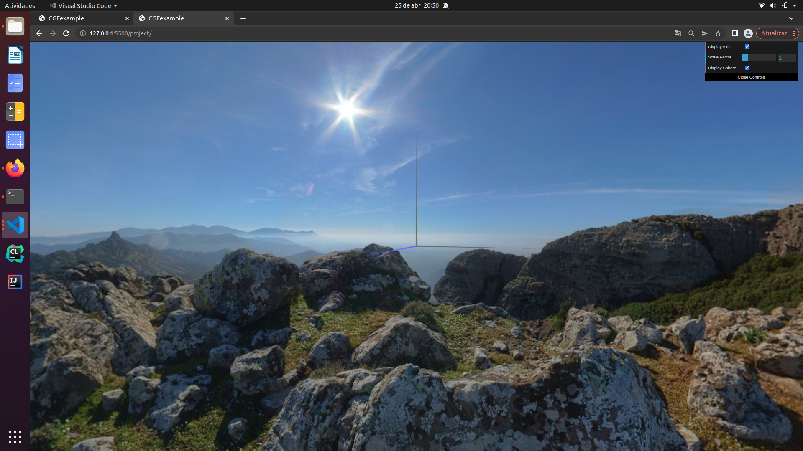
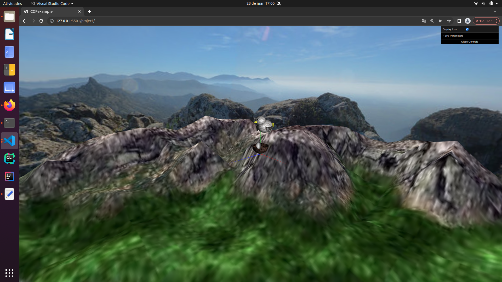
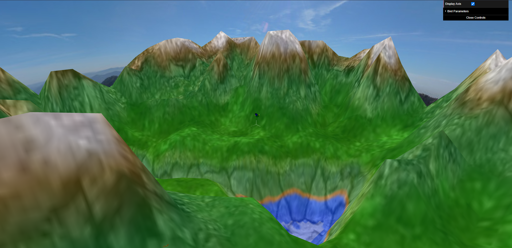
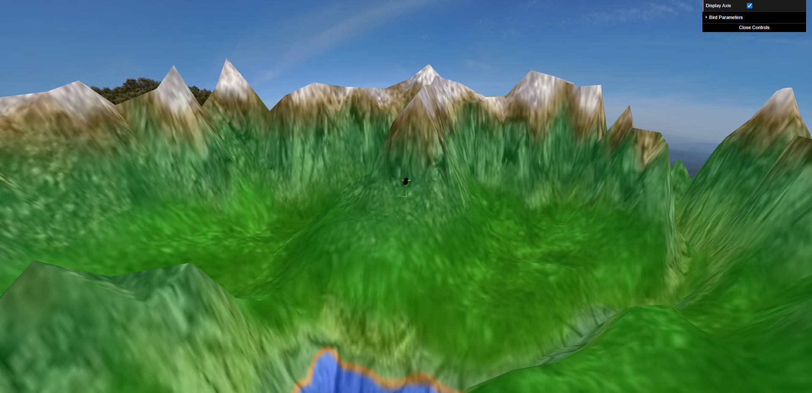
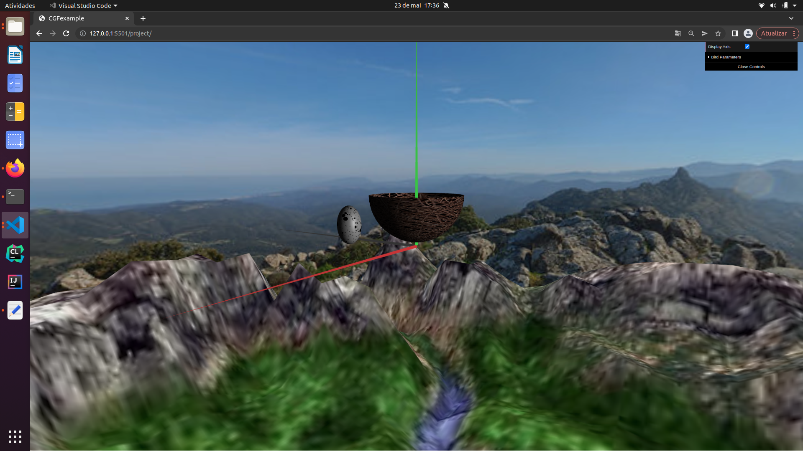
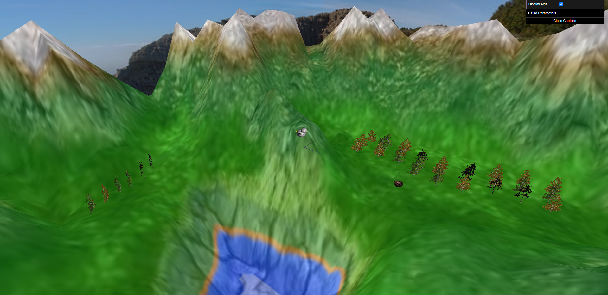

# CG 2022/2023

## Group T09G11

| Name               | Number    |
| ------------------ | --------- |
| Rui Pedro Silva    | 202005661 |
| Diogo Pinto        | 201906067 |

## OBSERVATIONS AND FUNCTIONALITIES

- Unfortunately we couldn't implement the "pick/drop eggs" method. 
- The billboard trees don't follow the camera movement correctly, the trees disappear depending on the camera position.

Figure 1 : Screenshot of the panorama

Figure 2 : Screenshot of the bird

Figure 3 : Screenshot of the terrain

Figure 4 : Screenshot of the terrain

Figure 5 : Screenshot of the eggs and nest

Figure 6 : Screenshot of the trees

## TREE TEXTURES

- https://sansarweb-media-production-w.akamaized.net/f6756338-0812-4791-ba67-4ae850736a64_800.png
- https://www.techmonkeybusiness.com/galleries/Texture_Galleries/Billboard_Trees/previews/003-BryceElm1.png.medium.jpeg